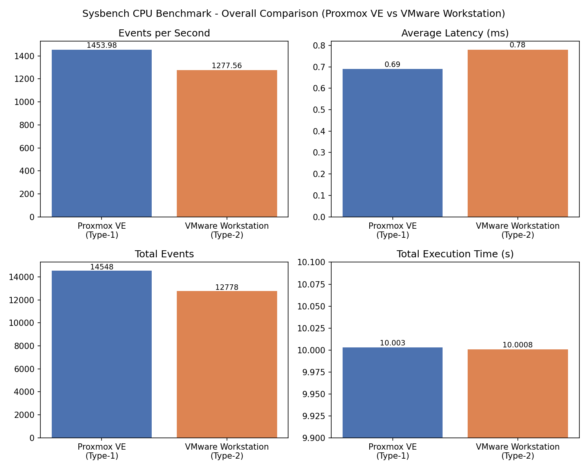
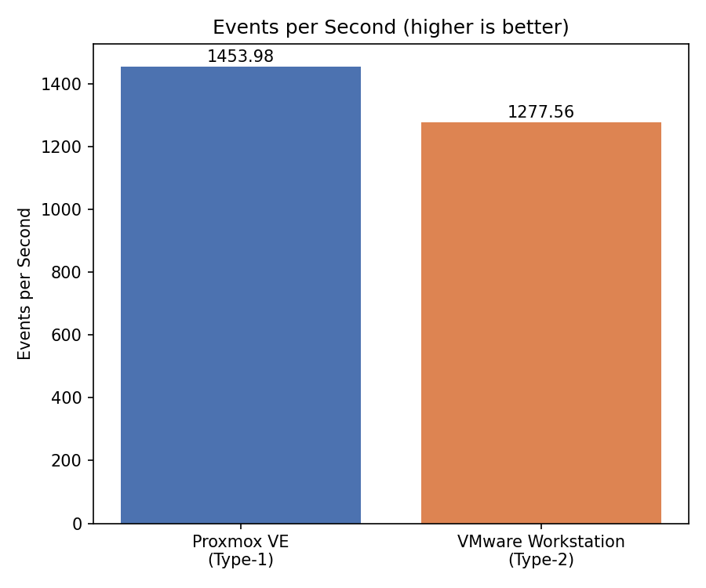
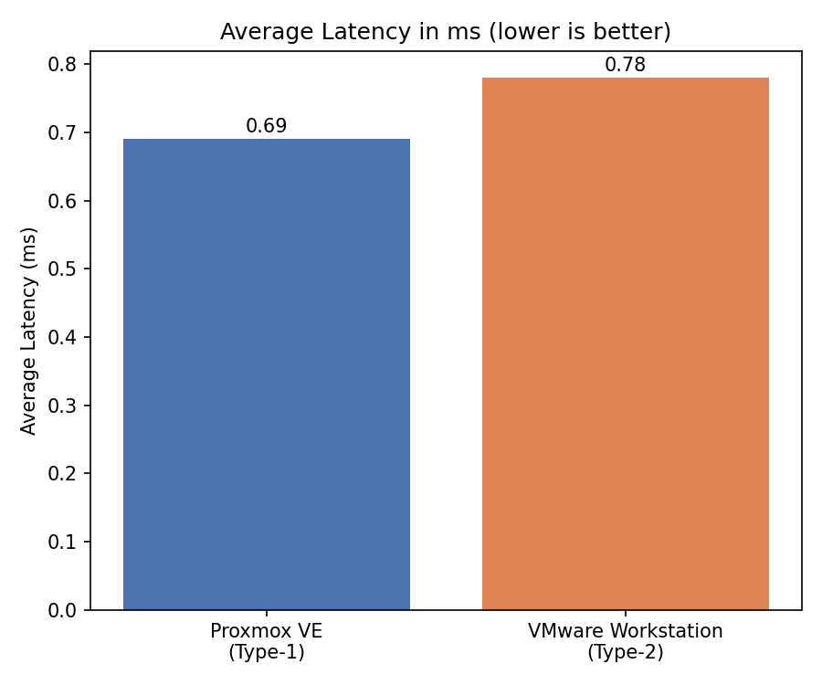
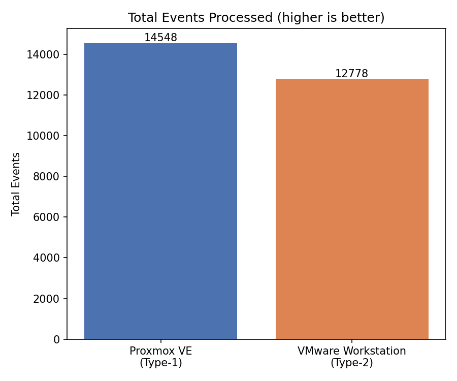

# 📊 Comparison — Type-1 vs Type-2 Hypervisor

## Result Table

| Metric | 🟣 Proxmox VE | 🔵 VMware Workstation |
|---|---:|---:|
| Total execution time | 10.0030 s | 10.0008 s |
| Total events | **14548** | 12778 |
| Events/sec | **1453.98** | 1277.56 |
| Average latency | **0.69 ms** | 0.78 ms |

## Visual Results

### 09 — Performance Dashboard

### 10 — Events per Second

### 11 — Average Latency

### 12 — Total Events

## Observation

Proxmox VE produced higher CPU throughput and lower average latency in this recorded experiment. Both VMs used the same guest configuration, making the result useful as a controlled comparison for this workload.

> The result is specific to the tested hardware, software versions and VM configuration.
