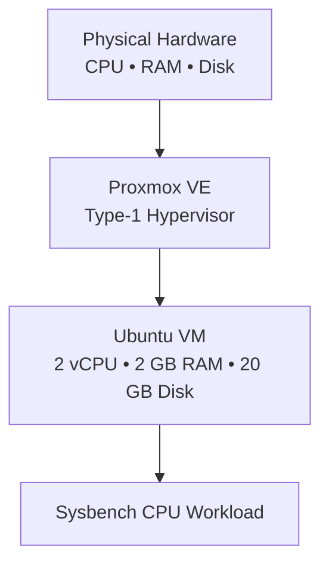
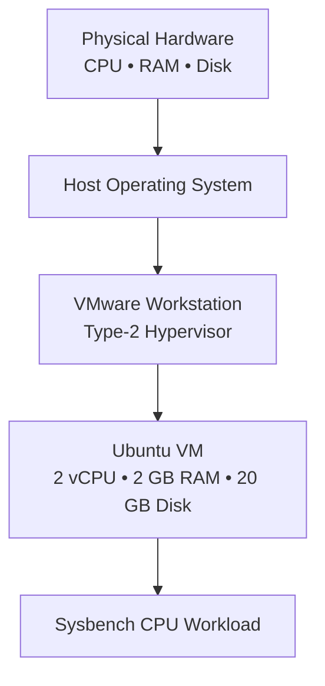

<div align="center">

# ⚡ Hypervisor Performance Analysis

### Type-1 vs Type-2 Hypervisor — Proxmox VE vs VMware Workstation

<p>
  
  
  
  
</p>

<p><b>A practical performance study of the same Ubuntu VM configuration running on a bare-metal Type-1 hypervisor and a hosted Type-2 hypervisor.</b></p>

</div>

---

## 🧭 Experiment at a Glance

| Item | Configuration |
|---|---|
| **Type-1 Hypervisor** | Proxmox VE |
| **Type-2 Hypervisor** | VMware Workstation |
| **Guest OS** | Ubuntu |
| **CPU** | 2 vCPU |
| **Memory** | 2 GB |
| **Disk** | 20 GB |
| **Benchmark** | Sysbench CPU |
| **Primary Metric** | Events per second |
| **Latency Metric** | Average latency |

> 🎯 **Aim:** Create the same Ubuntu VM on Proxmox VE and VMware Workstation, run the same Sysbench CPU workload, and compare the performance.

---

## 📚 Contents

- [1. Objective](#1-objective)
- [2. Hypervisors Used](#2-hypervisors-used)
- [3. Architecture](#3-architecture)
- [4. Common VM Configuration](#4-common-vm-configuration)
- [5. Type-1 — Proxmox VE](#5-type-1--proxmox-ve)
- [6. Type-2 — VMware Workstation](#6-type-2--vmware-workstation)
- [7. Benchmark Methodology](#7-benchmark-methodology)
- [8. Complete Screenshot Sequence](#8-complete-screenshot-sequence)
- [9. Results](#9-results)
- [10. Visual Comparison](#10-visual-comparison)
- [11. Technical Analysis](#11-technical-analysis)
- [12. Commands Used](#12-commands-used)
- [13. Lab Report](#13-lab-report)
- [14. Limitations & Future Work](#14-limitations--future-work)
- [15. Conclusion](#15-conclusion)
- [16. Repository Structure](#16-repository-structure)

---

# 1. 🎯 Objective

The experiment is designed to:

- Understand the difference between **Type-1 and Type-2 hypervisors**.
- Create an equivalent Ubuntu VM on both platforms.
- Keep CPU, memory and disk configuration the same.
- Run the same **Sysbench CPU benchmark**.
- Compare throughput and latency.
- Interpret why the two virtualization approaches can produce different results.

---

# 2. 🖥️ Hypervisors Used

### 🟣 Type-1 — Proxmox VE

Proxmox VE is used as the **bare-metal / Type-1 hypervisor**. It runs directly on the physical server hardware and manages virtual machines without a conventional desktop host OS underneath it.

### 🔵 Type-2 — VMware Workstation

VMware Workstation is used as the **hosted / Type-2 hypervisor**. It runs as an application on top of the host operating system and provides virtual hardware to the guest VM.

### Quick Comparison

| Feature | Type-1: Proxmox VE | Type-2: VMware Workstation |
|---|---|---|
| Hypervisor location | Directly on hardware | Above host OS |
| Host OS layer | No conventional host OS layer | Yes |
| VM isolation | Hypervisor-managed | Hypervisor + host OS |
| Typical use | Servers / data centers | Desktop / development |
| Experiment VM | Ubuntu, 2 vCPU, 2 GB RAM, 20 GB disk | Ubuntu, 2 vCPU, 2 GB RAM, 20 GB disk |

---

# 3. 🏗️ Architecture

## 3.1 Type-1 — Bare-Metal Architecture



**Key idea:** the hypervisor is positioned directly on the physical hardware.

---

## 3.2 Type-2 — Hosted Architecture



**Key idea:** the VM request travels through the hosted virtualization layer and the host OS before reaching the physical hardware.

---

## 3.3 Why the architecture matters

A Type-1 hypervisor can have less virtualization overhead because it controls the hardware more directly. A Type-2 hypervisor adds another software layer through the host operating system.

> ⚠️ This experiment demonstrates the result on the tested machines and configuration. It should not be treated as a universal rule for every hypervisor or workload.

---

# 4. ⚙️ Common VM Configuration

The VM configuration was kept equivalent so that the benchmark comparison is meaningful.

| Parameter | Value |
|---|---|
| Operating System | Ubuntu |
| CPU | 2 vCPU |
| RAM | 2 GB |
| Disk | 20 GB |
| Benchmark | Sysbench CPU |
| CPU workload | `--cpu-max-prime=20000` |

### Benchmark command

```bash
sysbench cpu --cpu-max-prime=20000 run
```

---

# 5. 🟣 Type-1 — Proxmox VE

## 5.1 Setup Procedure

1. Open the Proxmox web interface using `https://<PROXMOX_SERVER_IP>:8006`.
2. Proceed past the self-signed certificate warning.
3. Log in with the provided credentials.
4. Select **Create VM**.
5. Configure the VM:
   - Name: `CC-Experiment1-Type1`
   - Ubuntu ISO
   - Disk: 20 GB
   - CPU: 1 socket, 2 cores
   - Memory: 2048 MiB
   - Network: `vmbr0`
6. Start the VM and install Ubuntu.
7. Check the system configuration.
8. Install Sysbench.
9. Run the CPU benchmark.
10. Shut down the VM using `sudo poweroff`.

## 5.2 Commands

```bash
hostnamectl
lscpu
free -h
df -h
top
```

```bash
sudo apt update
sudo apt install sysbench -y
sysbench --version
sysbench cpu --cpu-max-prime=20000 run
sudo poweroff
```

## 5.3 📸 Type-1 Evidence

### Screenshot 01 — CPU configuration


**What it shows:** CPU details reported by the Ubuntu VM running on Proxmox VE.

### Screenshot 02 — Memory configuration


**What it shows:** Memory available to the Ubuntu VM using `free -h`.

### Screenshot 03 — Sysbench result


**What it shows:** Sysbench CPU benchmark output for the Type-1 VM.

### Type-1 Result

- **Total Execution Time:** 10.0030 s
- **Total Events:** 14,548
- **Events per Second:** **1,453.98**
- **Average Latency:** **0.69 ms**

---

# 6. 🔵 Type-2 — VMware Workstation

## 6.1 Setup Procedure

1. Open VMware Workstation.
2. Select **Create a New Virtual Machine**.
3. Choose **Typical (recommended)**.
4. Select the Ubuntu ISO.
5. Select Linux → Ubuntu 64-bit.
6. Name the VM `CC-Experiment1-Type2`.
7. Set disk size to 20 GB.
8. Customize hardware:
   - Memory: 2048 MB
   - Processors: 1 processor, 2 cores
   - Network Adapter: NAT
9. Power on and install Ubuntu.
10. Check CPU, memory, disk and system details.
11. Install Sysbench.
12. Run the same CPU benchmark.
13. Shut down the VM using `sudo poweroff`.

## 6.2 Commands

```bash
hostnamectl
lscpu
free -h
df -h
top
```

```bash
sudo apt update
sudo apt install sysbench -y
sysbench --version
sysbench cpu --cpu-max-prime=20000 run
sudo poweroff
```

## 6.3 📸 Type-2 Evidence

### Screenshot 04 — CPU configuration


**What it shows:** CPU details reported by the Ubuntu VM running on VMware Workstation.

### Screenshot 05 — Additional CPU details


**What it shows:** Additional CPU/system information captured during the VMware experiment.

### Screenshot 06 — Memory configuration


**What it shows:** Memory available to the Ubuntu VM using `free -h`.

### Screenshot 07 — Sysbench result


**What it shows:** Main Sysbench CPU benchmark output for the Type-2 VM.

### Screenshot 08 — Detailed Sysbench output


**What it shows:** Detailed Sysbench result captured during the VMware run.

### Type-2 Result

- **Total Execution Time:** 10.0008 s
- **Total Events:** 12,778
- **Events per Second:** **1,277.56**
- **Minimum Latency:** 0.65 ms
- **Average Latency:** **0.78 ms**
- **Maximum Latency:** 7.56 ms
- **95th Percentile:** 1.39 ms

---

# 7. 🧪 Benchmark Methodology

Both environments use the same CPU workload:

```bash
sysbench cpu --cpu-max-prime=20000 run
```

### Metrics collected

| Metric | Meaning | Better value |
|---|---|---|
| Total Execution Time | Duration of the benchmark | Lower |
| Total Events | Total completed CPU events | Higher |
| Events per Second | CPU throughput | Higher |
| Average Latency | Average time per event | Lower |

### Fairness conditions

- Same Ubuntu guest OS
- Same 2 vCPU allocation
- Same 2 GB RAM
- Same 20 GB disk
- Same Sysbench CPU workload
- Same prime limit: `20000`

---

# 8. 📸 Complete Screenshot Sequence

This section intentionally shows **every image supplied in the original project**, in experiment order.

## Phase A — Type-1 Proxmox

### 01 — Type-1 CPU


### 02 — Type-1 Memory


### 03 — Type-1 Sysbench


---

## Phase B — Type-2 VMware

### 04 — Type-2 CPU


### 05 — Type-2 Additional CPU Details


### 06 — Type-2 Memory


### 07 — Type-2 Sysbench


### 08 — Type-2 Detailed Sysbench


---

## Phase C — Comparison

### 09 — Comparison Dashboard


### 10 — Events per Second


### 11 — Average Latency


### 12 — Total Events


> ✅ **Image audit:** 12/12 supplied images are preserved and displayed in this README.

---

# 9. 📊 Results

## 9.1 Type-1 vs Type-2

| Metric | 🟣 Proxmox VE — Type-1 | 🔵 VMware Workstation — Type-2 |
|---|---:|---:|
| Total Execution Time | 10.0030 s | 10.0008 s |
| Total Events | **14,548** | 12,778 |
| Events / Second | **1,453.98** | 1,277.56 |
| Average Latency | **0.69 ms** | 0.78 ms |

### Performance difference

Using VMware as the comparison baseline:

- Proxmox throughput advantage ≈ **13.81%**
- Proxmox average latency advantage ≈ **11.54% lower latency**

These percentages describe this particular measured run.

---

# 10. 📈 Visual Comparison

## Chart 1 — Performance Dashboard


## Chart 2 — Events per Second


## Chart 3 — Average Latency


## Chart 4 — Total Events


---

# 11. 🔬 Technical Analysis

### CPU Throughput

Proxmox VE achieved **1,453.98 events/sec**, while VMware Workstation achieved **1,277.56 events/sec**.

A higher events-per-second value indicates that more CPU benchmark work was completed in the same approximate period.

### Latency

Proxmox reported an average latency of **0.69 ms**, compared with **0.78 ms** for VMware Workstation.

Lower latency means each benchmark event was completed with less average delay.

### Why can Type-1 perform better?

The architecture provides a likely explanation:

**Type-1:**

```text
Hardware
   ↓
Proxmox VE
   ↓
Ubuntu VM
   ↓
Application / Benchmark
```

**Type-2:**

```text
Hardware
   ↓
Host OS
   ↓
VMware Workstation
   ↓
Ubuntu VM
   ↓
Application / Benchmark
```

The Type-2 design introduces an additional host-OS layer. That can contribute to virtualization overhead.

> 🧠 **Important:** The measured difference is an experimental observation. Other workloads, hardware, VM settings, hypervisor versions and host conditions can produce different results.

---

# 12. 💻 Commands Used

### System information

```bash
hostnamectl
lscpu
free -h
df -h
top
```

### Install Sysbench

```bash
sudo apt update
sudo apt install sysbench -y
```

### Verify Sysbench

```bash
sysbench --version
```

### CPU benchmark

```bash
sysbench cpu --cpu-max-prime=20000 run
```

### Shutdown

```bash
sudo poweroff
```

---

# 13. 📝 Lab Report

## Aim

To create the same Ubuntu virtual machine on a Type-1 hypervisor (Proxmox VE) and a Type-2 hypervisor (VMware Workstation), execute a Sysbench CPU benchmark on both, and compare their performance.

## Requirements

- Proxmox VE server
- VMware Workstation
- Ubuntu ISO
- Sysbench
- Internet connection
- Equivalent VM configuration

## Procedure

### Type-1 — Proxmox VE

1. Access Proxmox through the browser.
2. Create an Ubuntu VM.
3. Allocate 2 vCPU, 2 GB RAM and 20 GB disk.
4. Install Ubuntu.
5. Verify system resources.
6. Install Sysbench.
7. Run the CPU benchmark.
8. Record the result.

### Type-2 — VMware Workstation

1. Open VMware Workstation.
2. Create an Ubuntu VM.
3. Allocate the same 2 vCPU, 2 GB RAM and 20 GB disk.
4. Install Ubuntu.
5. Verify system resources.
6. Install Sysbench.
7. Run the same CPU benchmark.
8. Record the result.

## Result

| Result | Proxmox VE | VMware Workstation |
|---|---:|---:|
| Events/sec | **1453.98** | 1277.56 |
| Total Events | **14548** | 12778 |
| Average Latency | **0.69 ms** | 0.78 ms |

---

# 14. ⚠️ Limitations & Future Work

## Limitations

- The comparison represents one experimental setup.
- Hardware and host conditions can affect benchmark values.
- Only the Sysbench CPU workload was compared.
- The experiment does not establish a universal performance ranking.
- Repeated runs would provide a stronger statistical comparison.

## Future Work

The experiment can be extended with:

- Memory benchmarks
- Disk I/O benchmarks using fio
- Network performance using iperf3
- Multi-thread scalability
- VM startup time
- Different CPU and RAM allocations
- Multiple benchmark repetitions
- Container vs VM comparison
- Kubernetes virtualization/container workloads

---

# 15. 🏁 Conclusion

The same Ubuntu VM configuration was tested on a **Type-1 Proxmox VE hypervisor** and a **Type-2 VMware Workstation hypervisor** using Sysbench CPU benchmarking.

In the recorded experiment:

- 🟣 **Proxmox VE:** 1,453.98 events/sec
- 🔵 **VMware Workstation:** 1,277.56 events/sec
- 🟣 Proxmox average latency: **0.69 ms**
- 🔵 VMware average latency: **0.78 ms**

Therefore, **Proxmox VE performed better in this particular CPU benchmark**, producing higher throughput and lower average latency.

The result is consistent with the architectural difference between the two approaches: Type-1 virtualization operates closer to the physical hardware, while Type-2 virtualization operates through a host operating system.

---

# 16. 📁 Repository Structure

```text
Hypervisor-Performance-Analysis/
│
├── README.md
│
├── assets/
│   ├── 01_type1_lscpu.jpg
│   ├── 02_type1_memory.jpg
│   ├── 03_type1_sysbench.jpg
│   ├── 04_type2_lscpu_1.jpg
│   ├── 05_type2_lscpu_2.jpg
│   ├── 06_type2_memory.jpg
│   ├── 07_type2_sysbench.jpg
│   ├── 08_type2_sysbench_details.jpg
│   ├── 09_comparison_dashboard.png
│   ├── 10_comparison_events_per_second.png
│   ├── 11_comparison_avg_latency.png
│   └── 12_comparison_total_events.png
│
├── Type-1-Proxmox/
│   ├── README.md
│   ├── lspuT.jpg
│   ├── free -h (2).jpg
│   └── SysbenchT1.jpg
│
├── Type-2-VMware/
│   ├── README.md
│   ├── lspu.jpg
│   ├── lspu1.jpg
│   ├── free -h.jpg
│   ├── Sysbench.jpg
│   └── sysbenchjpg.jpg
│
└── Comparison/
    ├── README.md
    ├── comparison-dashboard.png
    ├── comparison-events-per-second.png
    ├── comparison-avg-latency.png
    └── comparison-total-events.png
```

---

<div align="center">

### 🚀 Cloud Computing Lab • Hypervisor Performance Analysis

**Type-1 Proxmox VE vs Type-2 VMware Workstation**

</div>
