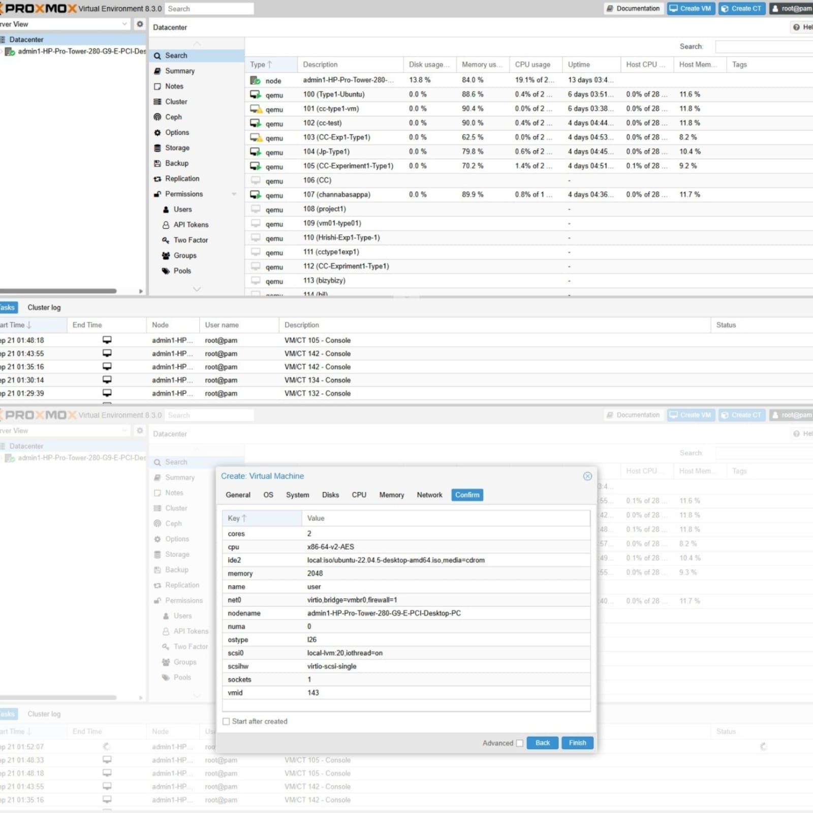
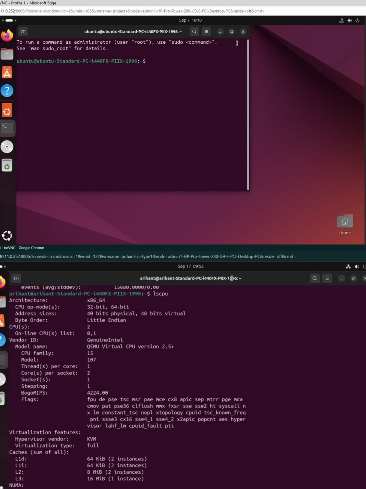
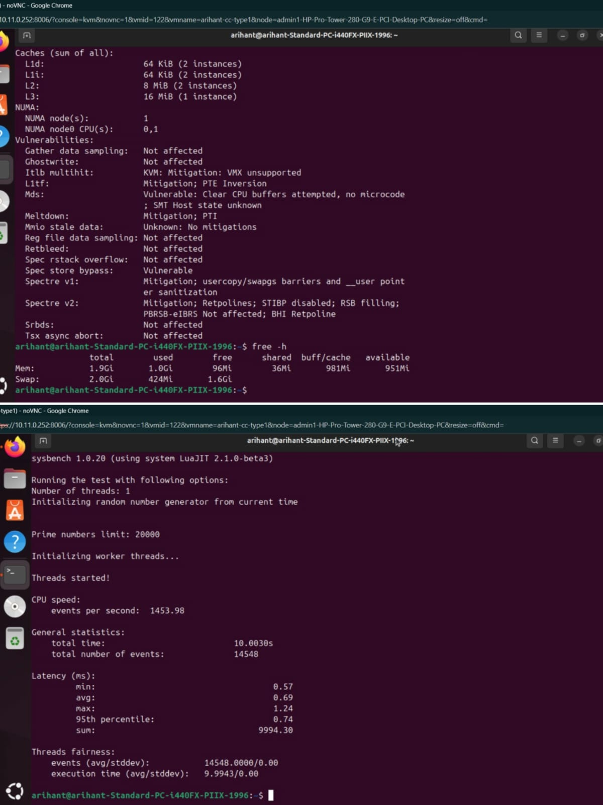

# 🟣 Type-1 Hypervisor — Proxmox VE

This folder contains the **Type-1 / bare-metal hypervisor** portion of the experiment.

## VM Configuration

| Parameter | Value |
|---|---|
| OS | Ubuntu |
| CPU | 2 vCPU |
| RAM | 2 GB |
| Disk | 20 GB |
| Network | `vmbr0` |
| Benchmark | Sysbench CPU |

## Procedure

1. Access the Proxmox web interface.
2. Create a VM named `CC-Experiment1-Type1`.
3. Select the Ubuntu ISO.
4. Allocate 20 GB disk, 2 vCPU and 2048 MiB RAM.
5. Configure network bridge `vmbr0`.
6. Start the VM and install Ubuntu.
7. Verify the VM configuration.
8. Install Sysbench.
9. Run the CPU benchmark.
10. Shut down the VM.

## Commands

```bash
sudo apt update
sudo apt install sysbench -y
sysbench --version
sysbench cpu --cpu-max-prime=20000 run
```

```bash
hostnamectl
lscpu
free -h
df -h
top
sudo poweroff
```

## 📸 Evidence

### 01 — CPU configuration


### 02 — Memory configuration


### 03 — Sysbench benchmark


## Result

- **Events/sec:** 1453.98
- **Total events:** 14548
- **Average latency:** 0.69 ms
