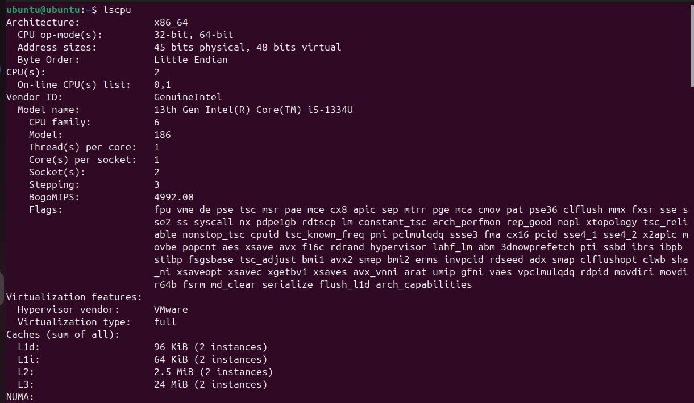
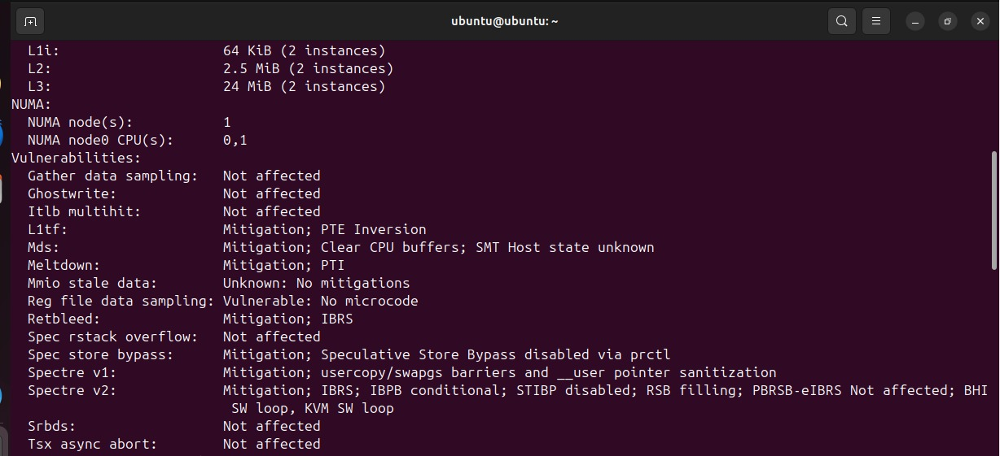
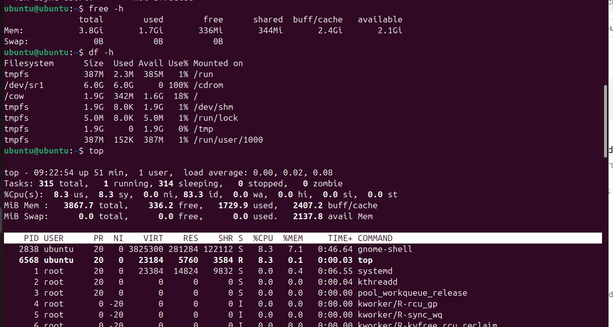
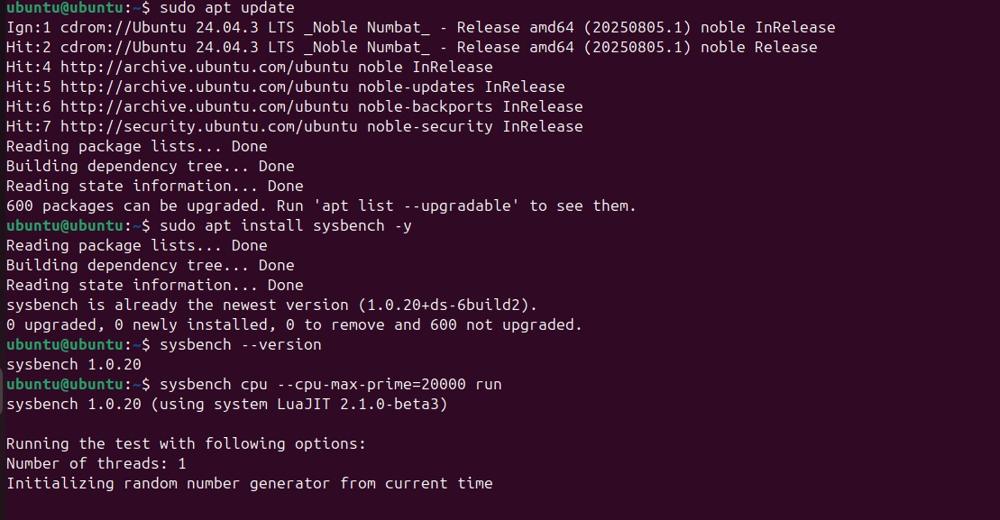
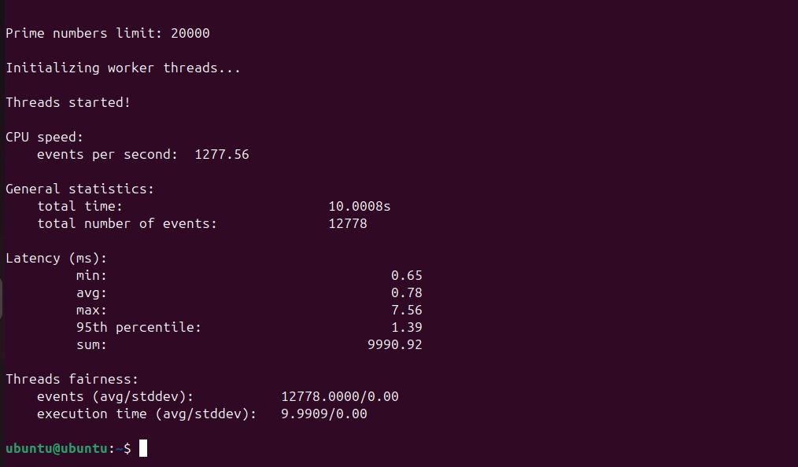

# 🔵 Type-2 Hypervisor — VMware Workstation

This folder contains the **Type-2 / hosted hypervisor** portion of the experiment.

## VM Configuration

| Parameter | Value |
|---|---|
| OS | Ubuntu |
| CPU | 2 vCPU |
| RAM | 2 GB |
| Disk | 20 GB |
| Network | NAT |
| Benchmark | Sysbench CPU |

## Procedure

1. Open VMware Workstation.
2. Create a new VM using the Ubuntu ISO.
3. Select Linux → Ubuntu 64-bit.
4. Allocate 20 GB disk, 2 vCPU and 2048 MB RAM.
5. Configure the network adapter as NAT.
6. Install Ubuntu.
7. Verify the VM configuration.
8. Install Sysbench.
9. Run the CPU benchmark.
10. Shut down the VM.

## Commands

```bash
sudo apt update
sudo apt install sysbench -y
sysbench --version
sysbench cpu --cpu-max-prime=20000 run
```

```bash
hostnamectl
lscpu
free -h
df -h
top
sudo poweroff
```

## 📸 Evidence

### 04 — CPU configuration


### 05 — Additional CPU details


### 06 — Memory configuration


### 07 — Sysbench benchmark


### 08 — Detailed Sysbench output


## Result

- **Events/sec:** 1277.56
- **Total events:** 12778
- **Average latency:** 0.78 ms
