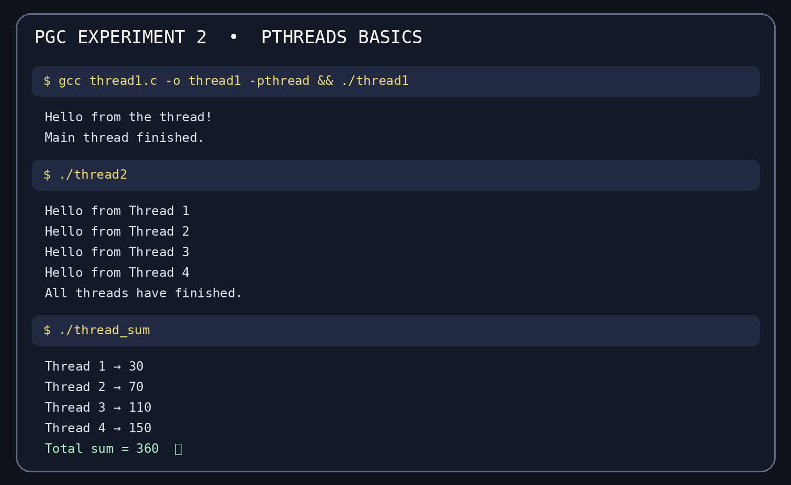
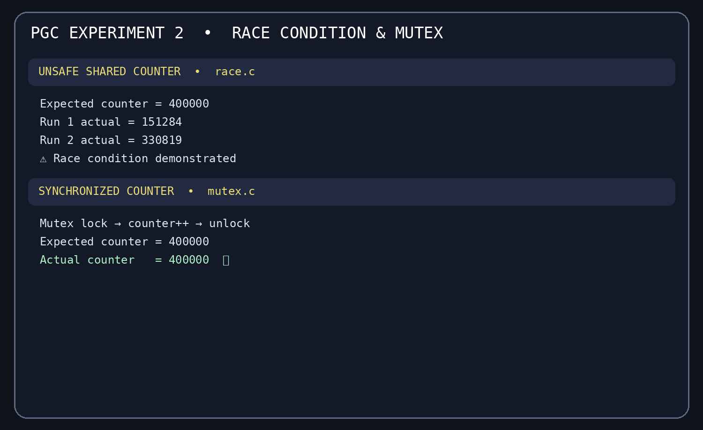
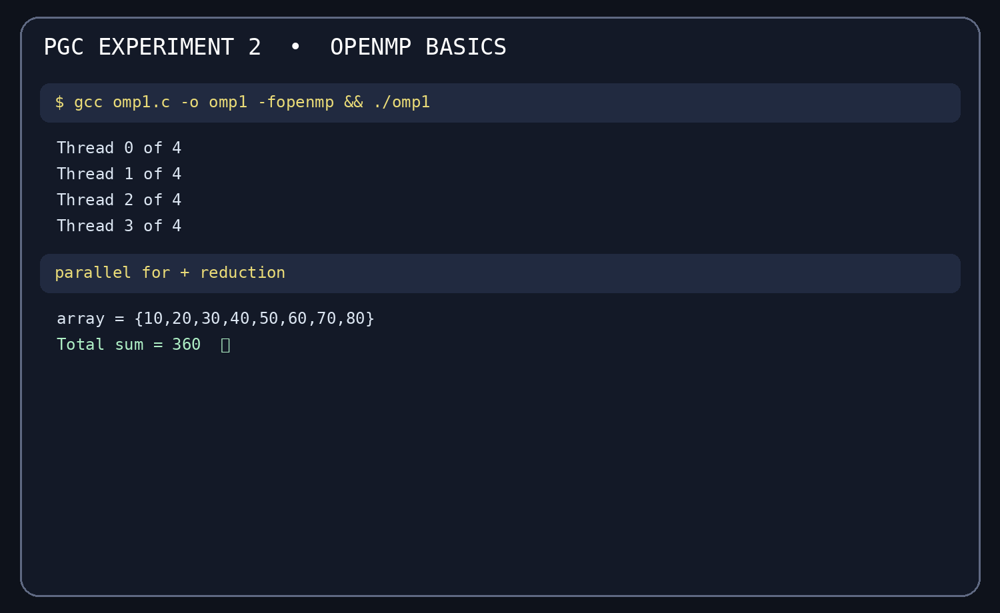
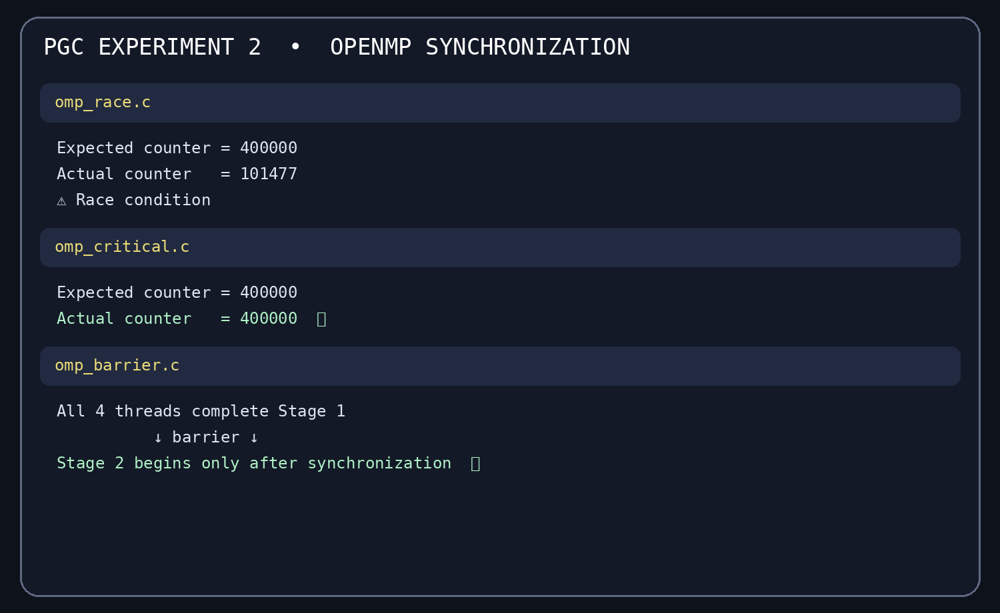
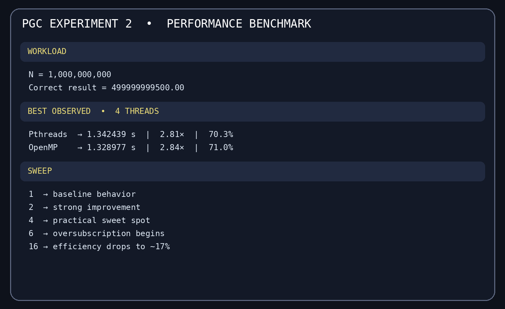
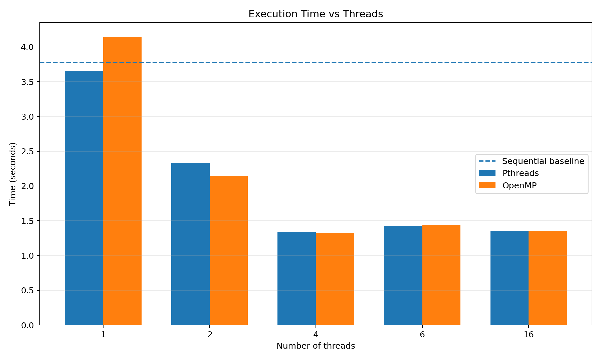
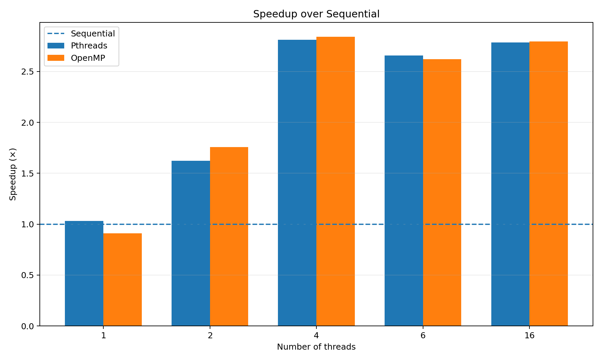
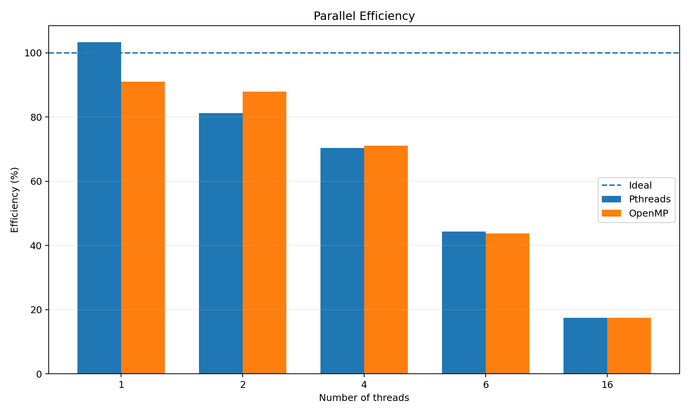

# 🧵 PGC Experiment 2 — Multithreaded Programming

<div align="center">

## Pthreads · OpenMP · Race Conditions · Synchronization · Benchmarking

**Author:** Sai Sri Ram  
**Course:** Parallel & GPU Computing Laboratory


</div>

> A complete, redesigned Experiment 2 report covering all major tasks, code, output evidence, graphs, formulas, observations, and conclusions.

---

## 🎯 Aim

To write multithreaded programs in C using **Pthreads** and **OpenMP**, demonstrate a **race condition**, fix it using a **Pthreads mutex** and an **OpenMP critical section**, demonstrate **barrier synchronization**, and compare performance for **1, 2, 4, 6, and 16 threads** against a sequential baseline.

## 🗺️ Experiment Map

| Part | Experiment | What it shows |
|---|---|---|
| 1 | 🧵 Pthreads basics | Thread creation, arguments, joins, and partial sums |
| 2 | 🔐 Race condition + mutex | Lost updates and mutual exclusion |
| 3 | ⚡ OpenMP basics | Parallel regions, parallel loops, and reduction |
| 4 | 🚦 Race + critical + barrier | Synchronization with OpenMP |
| 5 | 📈 Performance | Sequential vs Pthreads vs OpenMP |

## 🧮 Verification Problem

The performance programs compute:

```text
sum = Σ(i × 0.000001),  i = 0 ... N-1
N = 1,000,000,000
Correct result = 499999999500.00
```

All performance implementations should produce the same verification value.

---

# 🧵 PART 1 — Pthreads Basics

Pthreads (POSIX threads) gives explicit control over thread creation and synchronization.

### Key functions

| Function | Purpose |
|---|---|
| `pthread_create()` | Creates a new thread |
| `pthread_join()` | Waits for a thread to finish |
| `pthread_mutex_lock()` | Acquires a mutex |
| `pthread_mutex_unlock()` | Releases a mutex |
| `pthread_mutex_init()` | Initializes a mutex |
| `pthread_mutex_destroy()` | Destroys a mutex |

### Partial Sum Experiment

The 8-element array is divided across 4 threads.

| Thread | Elements | Partial Sum |
|---:|---|---:|
| 1 | 10 + 20 | 30 |
| 2 | 30 + 40 | 70 |
| 3 | 50 + 60 | 110 |
| 4 | 70 + 80 | 150 |
| **Total** | — | **360 ✅** |

### Compile and Run

```bash
cd pthreads

gcc thread1.c -o thread1 -pthread && ./thread1
gcc thread2.c -o thread2 -pthread && ./thread2
gcc thread_sum.c -o thread_sum -pthread && ./thread_sum
gcc race.c -o race -pthread && ./race
gcc mutex.c -o mutex -pthread && ./mutex
```

### 📸 Evidence — Pthreads Basics



---

# 🔥 PART 2 — Race Condition + Mutex

A race condition occurs when multiple threads access and modify shared data without synchronization.

For `counter++`, the operation is effectively:

```text
LOAD → ADD 1 → STORE
```

Two threads can read the same old value and overwrite each other's updates.

## ❌ Race Condition

Expected:

```text
400000
```

Observed in repeated runs:

```text
151284
330819
```

The result changes between runs because thread scheduling is nondeterministic.

## ✅ Mutex Solution

A mutex protects the shared counter update:

```text
LOCK
  counter++
UNLOCK
```

Correct output:

```text
Expected counter = 400000
Actual counter   = 400000
```

| Version | Synchronization | Result |
|---|---|---:|
| Pthreads race | None | 151284 / 330819 ⚠️ |
| Pthreads mutex | Mutex lock | 400000 ✅ |

### 📸 Evidence — Race + Mutex



---

# ⚡ PART 3 — OpenMP Basics

OpenMP is a shared-memory programming model using compiler directives and a runtime library.

### Constructs used

| Construct | Purpose |
|---|---|
| `#pragma omp parallel` | Creates a team of threads |
| `parallel for` | Divides loop iterations |
| `reduction` | Safely combines partial results |
| `critical` | Protects a critical section |
| `barrier` | Synchronizes execution phases |

### Reduction Result

```text
Total sum = 360
```

The reduction clause avoids the shared-update race by maintaining per-thread partial values before combining them.

### Compile and Run

```bash
cd openmp

gcc omp1.c -o omp1 -fopenmp && ./omp1
gcc omp_sum.c -o omp_sum -fopenmp && ./omp_sum
gcc omp_race.c -o omp_race -fopenmp && ./omp_race
gcc omp_critical.c -o omp_critical -fopenmp && ./omp_critical
gcc omp_barrier.c -o omp_barrier -fopenmp && ./omp_barrier
```

### 📸 Evidence — OpenMP Basics



---

# 🚦 PART 4 — OpenMP Race, Critical & Barrier

## ❌ OpenMP Race

```text
Expected counter = 400000
Actual counter   = 101477
```

The shared counter is modified by multiple threads without protection.

## ✅ OpenMP Critical

```text
Expected counter = 400000
Actual counter   = 400000
```

`#pragma omp critical` allows only one thread at a time to execute the protected section.

## ⏸️ Barrier Synchronization

A barrier creates a phase boundary.

Observed behavior:

```text
All four threads completed Stage 1
                ↓
           omp barrier
                ↓
Any thread can start Stage 2
```

This proves that the second stage does not begin until all participating threads have reached the barrier.

### 📸 Evidence — OpenMP Race, Critical & Barrier



---

# 🛠️ Pthreads vs OpenMP

| Feature | Pthreads | OpenMP |
|---|---|---|
| Thread creation | Manual | Runtime/directive based |
| Work distribution | Manual | Usually handled by runtime |
| Synchronization | Mutex, join, etc. | Critical, barrier, reduction |
| Programming level | Lower-level | Higher-level |
| Code complexity | More verbose | More concise |
| Control | Fine-grained | Convenient for parallel loops |
| Best fit | Explicit thread management | Shared-memory parallel loops |

### Viva point

> **OpenMP can give performance close to Pthreads while requiring much less thread-management code for common shared-memory loops.**

---

# 📈 PART 5 — Performance Benchmark

## Sequential Baseline

Five sequential runs were measured.

| Run | Time (s) |
|---:|---:|
| 1 | 3.331169 |
| 2 | 3.822338 |
| 3 | 3.496280 |
| 4 | 4.020941 |
| 5 | 4.199273 |
| **Average** | **3.774000** |

## Full Thread Sweep

| Threads | Pthreads time (s) | Pthreads Speedup | Pthreads Efficiency | OpenMP time (s) | OpenMP Speedup | OpenMP Efficiency |
|:---:|---:|---:|---:|---:|---:|---:|
| 1 | 3.655563 | 1.03× | 103.2% | 4.145702 | 0.91× | 91.0% |
| 2 | 2.325327 | 1.62× | 81.1% | 2.145581 | 1.76× | 87.9% |
| 4 | **1.342439** | **2.81×** | **70.3%** | **1.328977** | **2.84×** | **71.0%** |
| 6 | 1.419750 | 2.66× | 44.3% | 1.439114 | 2.62× | 43.7% |
| 16 | 1.355168 | 2.78× | 17.4% | 1.349932 | 2.80× | 17.5% |

## 🧮 Formulas

```text
Speedup = Sequential Time / Parallel Time

Efficiency = (Speedup / Number of Threads) × 100
```

## 🏆 Best Observed Point

At **4 threads**:

| Implementation | Time (s) | Speedup | Efficiency |
|---|---:|---:|---:|
| Pthreads | **1.342439** | **2.81×** | **70.3%** |
| OpenMP | **1.328977** | **2.84×** | **71.0%** |

The practical sweet spot occurs at 4 threads for the reference 4-CPU VM. Beyond that, extra threads compete for the same logical CPUs.

### 📸 Evidence — Performance



---

# 📊 Performance Graphs

### 1. Execution Time vs Threads

Lower is better.



### 2. Speedup over Sequential

Higher is better.



### 3. Parallel Efficiency

Closer to 100% is better.



Run the graph script with:

```bash
python3 make_graphs.py
```

---

# 🧠 Observations & Analysis

| Observation | Explanation |
|---|---|
| Race results change between runs | Thread scheduling is nondeterministic |
| Mutex gives exactly 400000 | Mutual exclusion prevents lost updates |
| Critical gives exactly 400000 | OpenMP serializes the protected update |
| 4 threads perform best | The reference VM exposes 4 logical CPUs |
| 6 and 16 threads do not scale further | Oversubscription and scheduling overhead |
| Pthreads ≈ OpenMP | Similar computational work with different programming models |
| 1-thread OpenMP can be slower | OpenMP runtime overhead + measurement noise |
| VM timings vary | Virtualization and host load affect timing |

### ⚠️ About the 103.2% single-thread efficiency

The 103.2% value is produced by comparing a one-thread Pthreads measurement against a separately averaged sequential baseline. It does not mean a thread achieved more than 100% physical efficiency; it reflects measurement and baseline variation.

---

# ✅ Conclusion

Experiment 2 demonstrates the foundations of C multithreading:

```text
Pthreads     → explicit thread creation and joining
OpenMP       → directive-based shared-memory parallelism
Race         → incorrect shared update without synchronization
Mutex        → safe Pthreads synchronization
Critical     → safe OpenMP synchronization
Barrier      → phase synchronization
Benchmarking → speedup and efficiency analysis
```

The reference benchmark shows that **4 threads** provide the best practical point on the 4-CPU VM, reaching about **2.81× speedup with Pthreads** and **2.84× with OpenMP**. Increasing the thread count beyond the available CPUs does not produce proportional gains.

---

# 📁 Repository Structure

```text
Experiment-2/
├── README.md
├── results.txt
├── make_graphs.py
├── pthreads/
│   ├── thread1.c
│   ├── thread2.c
│   ├── thread_sum.c
│   ├── race.c
│   ├── mutex.c
│   └── output_pthreads.txt
├── openmp/
│   ├── omp1.c
│   ├── omp_sum.c
│   ├── omp_race.c
│   ├── omp_critical.c
│   ├── omp_barrier.c
│   └── output_openmp.txt
├── performance/
│   ├── sequential.c
│   ├── pthread_perf.c
│   └── omp_perf.c
├── graphs/
│   ├── execution_time.png
│   ├── speedup.png
│   └── efficiency.png
└── screenshots/
    ├── pthreads_basic.png
    ├── pthreads_race_mutex.png
    ├── openmp_basic.png
    ├── openmp_race_critical.png
    └── performance.png
```

---

# 🧾 Completion Checklist

- ✅ Pthreads thread creation
- ✅ Multiple Pthreads
- ✅ Pthreads partial-sum experiment
- ✅ Pthreads race condition
- ✅ Pthreads mutex solution
- ✅ OpenMP parallel region
- ✅ OpenMP reduction
- ✅ OpenMP race condition
- ✅ OpenMP critical section
- ✅ OpenMP barrier
- ✅ Sequential baseline
- ✅ 1 / 2 / 4 / 6 / 16-thread benchmark
- ✅ Speedup formula
- ✅ Efficiency formula
- ✅ Execution-time graph
- ✅ Speedup graph
- ✅ Efficiency graph
- ✅ Output evidence
- ✅ Observations
- ✅ Conclusion

<div align="center">

### ⚡ Understand → Implement → Parallelize → Measure → Analyze ⚡

**Sai Sri Ram · PGC Experiment 2**

</div>
