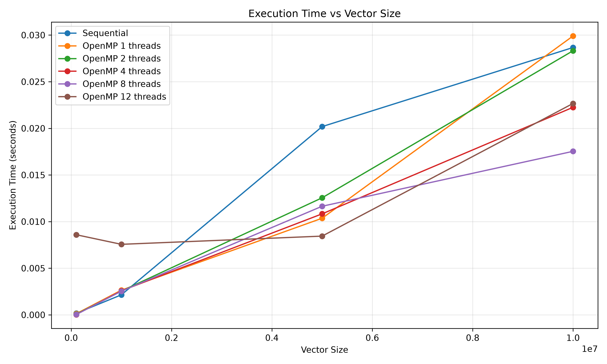
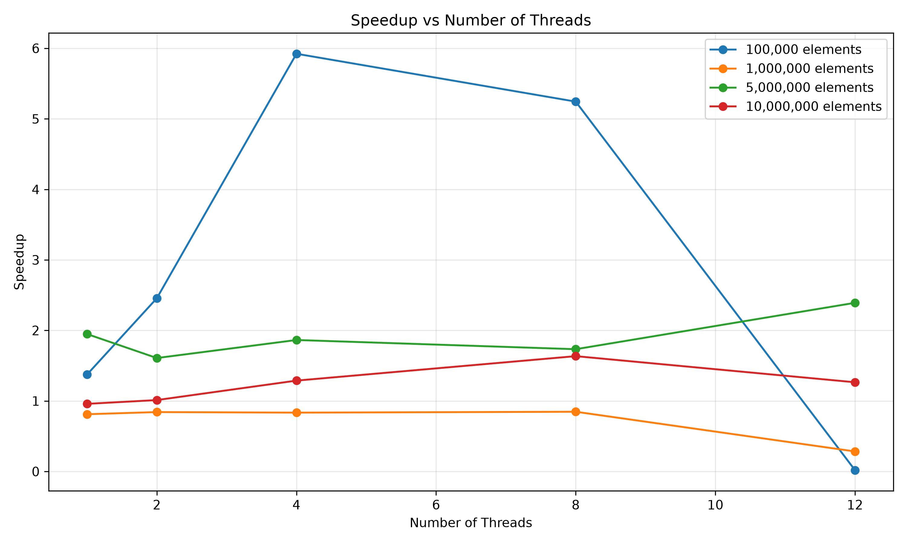
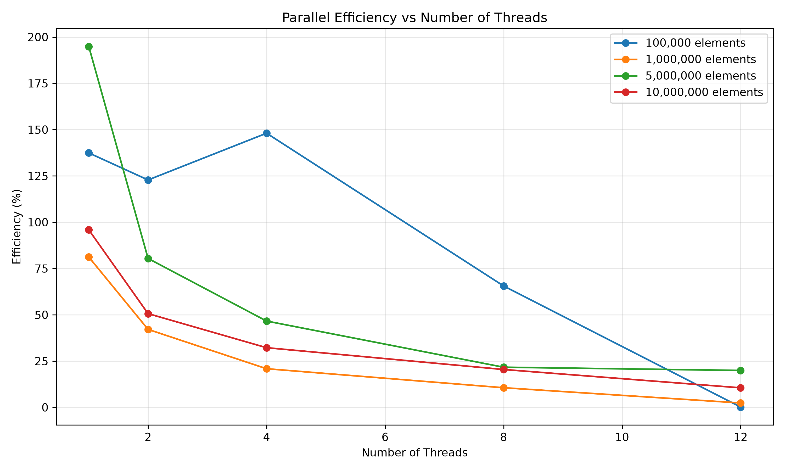
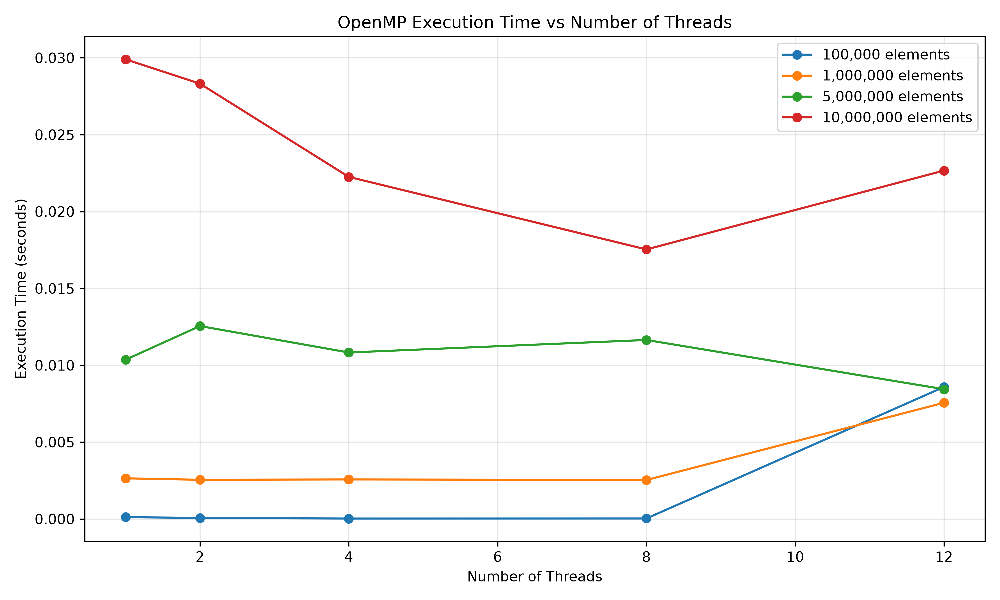

# Parallel Vector Multiplication using OpenMP

## Team Members

| Name | USN |
|---|---|
| Shrikar | 01FE24BCI013 |
| Shreya | 01FE24BCI033 |
| Sai Shree Ram | 01FE24BCI034 |
| Ankush | 01FE24BCI096 |

---

## 1. Problem Definition

Perform element-wise multiplication of two vectors and compare the execution time of a sequential implementation with a parallel implementation using OpenMP.

The experiment evaluates how execution time changes with different vector sizes and different numbers of OpenMP threads.

For two input vectors:

```text
A = [A0, A1, A2, ..., An-1]

B = [B0, B1, B2, ..., Bn-1]
```

the resulting vector is calculated as:

```text
C[i] = A[i] × B[i]
```

for every element `i`.

The sequential implementation performs the operation one element at a time, while the OpenMP implementation distributes independent iterations across multiple threads.

---

## 2. Objective

The objectives of this experiment are:

- Implement sequential vector multiplication.
- Implement parallel vector multiplication using OpenMP.
- Execute the programs with different vector sizes.
- Execute the parallel program using different numbers of threads.
- Measure execution time.
- Calculate speedup.
- Calculate parallel efficiency.
- Generate graphs for performance comparison.
- Analyze the effect of vector size on performance.
- Analyze the effect of thread count on performance.
- Compare sequential and parallel execution.

---

## 3. Sequential Algorithm

Given two input vectors `A` and `B`:

1. Create vectors `A`, `B` and `C`.
2. Initialize vectors `A` and `B`.
3. Iterate through every element.
4. Perform element-wise multiplication.
5. Store the result in vector `C`.
6. Measure the execution time.
7. Display sample output values.

### Pseudocode

```text
START

Read vector size N

Create vectors A, B and C of size N

FOR i = 0 to N-1
    A[i] = 1 + (i mod 100)
    B[i] = 2 + (i mod 50)
END FOR

START TIMER

FOR i = 0 to N-1
    C[i] = A[i] × B[i]
END FOR

STOP TIMER

Display execution time

Display first five values of C

END
```

### Sequential Implementation

The sequential implementation is available at:

```text
src/vector_sequential.cpp
```

---

## 4. Parallel Design using OpenMP

The parallel implementation uses OpenMP to distribute the vector multiplication loop among multiple threads.

The vector multiplication operation is suitable for parallel execution because every iteration is independent.

For every index:

```text
C[i] = A[i] × B[i]
```

there is no dependency on another iteration.

### OpenMP Parallelization

The sequential loop:

```cpp
for (long long i = 0; i < N; i++) {
    C[i] = A[i] * B[i];
}
```

is parallelized using:

```cpp
#pragma omp parallel for
```

The complete parallel loop is:

```cpp
#pragma omp parallel for
for (long long i = 0; i < N; i++) {
    C[i] = A[i] * B[i];
}
```

The number of threads is provided as a command-line argument.

### Parallel Implementation

```text
src/vector_openmp.cpp
```

---

## 5. Compilation and Execution

### 5.1 Compile Sequential Version

From the project root:

```bash
g++ -O2 src/vector_sequential.cpp -o vector_sequential
```

Run the sequential program:

```bash
./vector_sequential 1000000
```

Example:

```text
Sequential Vector Multiplication
Vector size: 1000000
Execution time: 0.001280 seconds

Sample results:
C[0] = 2.000000
C[1] = 6.000000
C[2] = 12.000000
C[3] = 20.000000
C[4] = 30.000000
```

---

### 5.2 Compile OpenMP Version

Compile using:

```bash
g++ -O2 -fopenmp src/vector_openmp.cpp -o vector_openmp
```

The `-fopenmp` option enables OpenMP support.

Run with one thread:

```bash
./vector_openmp 1000000 1
```

Run with two threads:

```bash
./vector_openmp 1000000 2
```

Run with four threads:

```bash
./vector_openmp 1000000 4
```

Run with eight threads:

```bash
./vector_openmp 1000000 8
```

Run with twelve threads:

```bash
./vector_openmp 1000000 12
```

---

## 6. Automated Benchmark

An automated benchmark program was developed to evaluate the sequential and parallel implementations across multiple vector sizes and thread counts.

### Vector Sizes

The experiment uses:

```text
100,000
1,000,000
5,000,000
10,000,000
```

### Thread Counts

The OpenMP implementation is tested using:

```text
1
2
4
8
12
```

Each configuration is executed multiple times and the average execution time is recorded.

### Compile Benchmark

```bash
g++ -O2 -fopenmp src/benchmark.cpp -o benchmark
```

### Run Benchmark

```bash
./benchmark
```

The raw benchmark data is saved to:

```text
results/raw_results.csv
```

---

## 7. Performance Metrics

### 7.1 Execution Time

Execution time represents the amount of time required to complete the vector multiplication operation.

Lower execution time indicates better performance.

---

### 7.2 Speedup

Speedup measures how much faster the parallel implementation is compared with the sequential implementation.

The formula used is:

```text
Speedup = Sequential Time / Parallel Time
```

For example, if:

```text
Sequential Time = 0.020 seconds
Parallel Time   = 0.010 seconds
```

then:

```text
Speedup = 0.020 / 0.010
        = 2×
```

---

### 7.3 Parallel Efficiency

Parallel efficiency measures how effectively the available threads are being utilized.

The formula used is:

```text
Efficiency = Speedup / Number of Threads × 100
```

For example:

```text
Speedup = 4×
Threads = 4
```

then:

```text
Efficiency = 4 / 4 × 100
           = 100%
```

---

## 8. Experimental Results

The benchmark was performed using four vector sizes and five different OpenMP thread configurations.

### Complete Results

| Vector Size | Threads | Parallel Time (s) | Speedup | Efficiency |
|---:|---:|---:|---:|---:|
| 100,000 | 1 | 0.000011 | 1.37105× | 137.05% |
| 100,000 | 2 | 0.000068 | 2.75416× | 122.81% |
| 100,000 | 4 | 0.000027 | 5.92244× | 148.06% |
| 100,000 | 8 | 0.000031 | 5.24383× | 65.55% |
| 100,000 | 12 | 0.000860 | 0.18804× | 1.57% |
| 1,000,000 | 1 | 0.002643 | 0.81163× | 81.16% |
| 1,000,000 | 2 | 0.002548 | 0.84208× | 42.10% |
| 1,000,000 | 4 | 0.002571 | 0.83415× | 20.85% |
| 1,000,000 | 8 | 0.002534 | 0.84658× | 10.58% |
| 1,000,000 | 12 | 0.007561 | 0.28373× | 2.36% |
| 5,000,000 | 1 | 0.010359 | 1.94860× | 194.86% |
| 5,000,000 | 2 | 0.012551 | 1.60830× | 80.41% |
| 5,000,000 | 4 | 0.010829 | 1.86398× | 46.60% |
| 5,000,000 | 8 | 0.011644 | 1.73352× | 21.67% |
| 5,000,000 | 12 | 0.008441 | 2.39125× | 19.93% |
| 10,000,000 | 1 | 0.029905 | 0.95865× | 95.87% |
| 10,000,000 | 2 | 0.028320 | 1.01230× | 50.62% |
| 10,000,000 | 4 | 0.022255 | 1.28817× | 32.20% |
| 10,000,000 | 8 | 0.017534 | 1.63498× | 20.44% |
| 10,000,000 | 12 | 0.022668 | 1.26471× | 10.54% |

The complete raw dataset is available at:

```text
results/raw_results.csv
```

---

## 9. Performance Graphs

All graphs were generated using Python and Matplotlib from the benchmark results.

### 9.1 Execution Time vs Vector Size



This graph compares execution time as the vector size increases.

The graph demonstrates how the amount of data affects the time required for vector multiplication.

---

### 9.2 Speedup vs Number of Threads



This graph shows how speedup changes as the number of OpenMP threads increases.

Increasing the number of threads can improve performance when sufficient computational work is available. However, speedup is not always proportional to the number of threads because of parallelization overhead and hardware limitations.

---

### 9.3 Efficiency vs Number of Threads



This graph shows the calculated parallel efficiency for different thread counts.

Efficiency generally decreases as the number of threads increases because the available workload is divided among more threads while thread-management and synchronization overhead remain present.

---

### 9.4 Execution Time vs Number of Threads



This graph compares execution time for different OpenMP thread counts.

It helps identify the thread configuration that provides the lowest execution time for the tested workloads.

---

## 10. Performance Analysis

### 10.1 Effect of Vector Size

For small vector sizes, the computation itself is very short. Therefore, OpenMP thread-management overhead can become significant compared with the actual multiplication workload.

As vector size increases, there is more work available to distribute among multiple threads.

The larger vector sizes therefore provide a better opportunity to observe the benefits of parallel execution.

---

### 10.2 Effect of Thread Count

Increasing the number of OpenMP threads does not always result in proportional performance improvement.

The experiment was performed using:

```text
1, 2, 4, 8 and 12 threads
```

The results demonstrate that the best thread count depends on the vector size.

For some workloads, increasing the thread count reduces execution time. For others, additional threads introduce overhead and may increase execution time.

---

### 10.3 Parallel Overhead

OpenMP introduces overhead associated with:

- Thread creation and management.
- Work distribution.
- Scheduling.
- Synchronization.
- Memory access.

For relatively small workloads, this overhead can become significant.

For larger workloads, the computational work becomes large enough that the overhead can be amortized over more operations.

---

### 10.4 Hardware Limitations

The experiment was conducted on a system with:

```text
CPU: 13th Gen Intel(R) Core(TM) i5-13420H
Logical CPUs: 12
```

The availability of 12 logical CPUs allows the experiment to evaluate thread counts up to 12.

However, using more threads does not automatically guarantee better performance. Performance is also affected by memory bandwidth, CPU architecture, cache behavior, operating-system scheduling and other running processes.

---

## 11. Correctness Verification

The first five elements of the resulting vector were displayed after execution.

For the initialized input vectors:

```text
A[0] = 1
B[0] = 2

A[1] = 2
B[1] = 3

A[2] = 3
B[2] = 4

A[3] = 4
B[3] = 5

A[4] = 5
B[4] = 6
```

the expected results are:

```text
C[0] = 2
C[1] = 6
C[2] = 12
C[3] = 20
C[4] = 30
```

The sequential and OpenMP implementations produced:

```text
C[0] = 2.000000
C[1] = 6.000000
C[2] = 12.000000
C[3] = 20.000000
C[4] = 30.000000
```

This verifies that both implementations perform the intended element-wise multiplication.

---

## 12. Graph Generation

The graphs were generated using the Python script:

```text
graphs/generate_graphs.py
```

The script reads:

```text
results/raw_results.csv
```

and generates:

```text
graphs/execution_time_vs_vector_size.png
graphs/speedup_vs_threads.png
graphs/efficiency_vs_threads.png
graphs/execution_time_vs_threads.png
```

To regenerate the graphs:

```bash
python graphs/generate_graphs.py
```

---

## 13. Project Structure

```text
parallel-vector-multiplication/
│
├── README.md
│
├── src/
│   ├── vector_sequential.cpp
│   ├── vector_openmp.cpp
│   └── benchmark.cpp
│
├── data/
│   └── .gitkeep
│
├── results/
│   └── raw_results.csv
│
├── graphs/
│   ├── execution_time_vs_vector_size.png
│   ├── execution_time_vs_threads.png
│   ├── speedup_vs_threads.png
│   ├── efficiency_vs_threads.png
│   └── generate_graphs.py
│
├── report/
│   └── .gitkeep
│
└── presentation/
    └── .gitkeep
```

---

## 14. Requirements

The experiment requires:

- Ubuntu / WSL
- GCC / G++
- OpenMP
- Python 3
- Matplotlib

### Check GCC

```bash
g++ --version
```

### Check Python

```bash
python3 --version
```

### Install Matplotlib

A Python virtual environment is recommended.

Create a virtual environment:

```bash
python3 -m venv .venv
```

Activate it:

```bash
source .venv/bin/activate
```

Install Matplotlib:

```bash
pip install matplotlib
```

---

## 15. Complete Workflow

Clone the repository:

```bash
git clone <repository-url>
```

Enter the project:

```bash
cd parallel-vector-multiplication
```

Compile the sequential program:

```bash
g++ -O2 src/vector_sequential.cpp -o vector_sequential
```

Compile the OpenMP program:

```bash
g++ -O2 -fopenmp src/vector_openmp.cpp -o vector_openmp
```

Compile the benchmark:

```bash
g++ -O2 -fopenmp src/benchmark.cpp -o benchmark
```

Run the benchmark:

```bash
./benchmark
```

Generate graphs:

```bash
python graphs/generate_graphs.py
```

The final results can be found in:

```text
results/raw_results.csv
```

and the performance graphs can be found in:

```text
graphs/
```

---

## 16. Conclusion

The experiment successfully implements both sequential and OpenMP-based parallel vector multiplication.

The sequential implementation performs the vector multiplication using a single execution flow, while the OpenMP implementation distributes independent vector elements among multiple threads.

The experiment evaluates the effect of:

- Vector size.
- Number of OpenMP threads.
- Execution time.
- Speedup.
- Parallel efficiency.

The results demonstrate that OpenMP can improve the performance of computationally independent operations such as vector multiplication. However, the performance improvement depends on workload size and the number of available processing resources.

Increasing the number of threads does not always produce proportional speedup because of thread-management overhead, scheduling, memory bandwidth and hardware limitations.

Overall, the experiment demonstrates the fundamental principles of shared-memory parallel programming using OpenMP and provides a practical comparison between sequential and parallel execution.

---

## 17. Team Contribution

| Team Member | Contribution |
|---|---|
| Shrikar | Parallel implementation and testing |
| Shreya | Benchmarking and result collection |
| Sai Shree Ram | Performance analysis and graphs |
| Ankush | Sequential implementation, OpenMP integration, repository organization and documentation |

---
