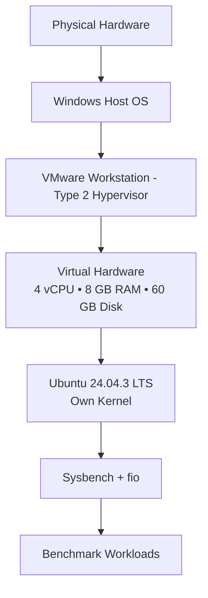
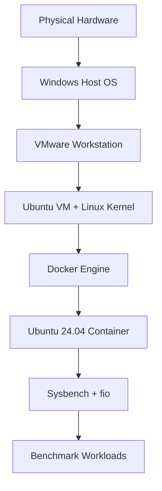

# ⚡ Performance Analysis of Virtual Machines and Containers

### Cloud Computing / Parallel & GPU Computing Lab — Experiment 2

> **VMware Workstation Ubuntu VM vs Docker Container**  
> Same workload • Same virtual resources • Repeated benchmark runs • Statistical comparison

---

## 📌 Aim

To experimentally compare the performance of an Ubuntu Virtual Machine running on **VMware Workstation** with a **Docker container**, using equivalent CPU, memory and disk-I/O workloads.

---

## 🎯 Objectives

- Compare VM and container performance under the same workload.
- Measure CPU, memory and sequential disk-write performance.
- Repeat CPU and memory benchmarks to reduce the effect of a single unusual run.
- Preserve raw benchmark outputs for reproducibility.
- Analyse the results using averages and basic statistical measures.

---

## 🧠 Experiment at a Glance

| Component | Virtual Machine | Container |
|---|---|---|
| Platform | VMware Workstation | Docker |
| Guest environment | Ubuntu 24.04.3 LTS | Ubuntu 24.04 image |
| CPU allocation | 4 vCPU | 4 CPU limit |
| Memory | 7.7 GiB | 8 GB limit |
| CPU benchmark | Sysbench | Sysbench |
| Memory benchmark | Sysbench | Sysbench |
| Disk benchmark | fio | fio |
| CPU/memory runs | 10 | 10 |
| Disk runs | 1 | 1 |

> **Important:** The Docker container was executed **inside the same Ubuntu VM**. Therefore, this experiment compares direct execution in the VM with containerized execution inside that VM; it is not a physical-host VM-versus-container benchmark.

---

## 🏗️ 1. Architecture

### 1.1 Virtual Machine Architecture



### 1.2 Docker Container Architecture



### 🔍 VM vs Container — Core Difference

| Feature | Virtual Machine | Docker Container |
|---|---|---|
| Kernel | Has its own guest kernel | Shares host/VM kernel |
| Isolation | Virtual hardware + hypervisor | Linux namespaces + cgroups |
| Startup | Boots an operating system | Starts an isolated process |
| Resource overhead | Higher | Lower |
| Image/disk footprint | Larger | Smaller layered image |
| Tool used | VMware Workstation | Docker |

---

## 🖥️ 2. Experimental Environment

- **Hypervisor:** VMware Workstation
- **Guest OS:** Ubuntu 24.04.3 LTS (amd64)
- **vCPU:** 4
- **Memory:** 7.7 GiB
- **Virtual Disk:** 60 GB
- **Docker:** 29.1.3
- **Sysbench:** 1.0.20
- **fio:** 3.36
- **iperf3:** 3.16
- **Python:** 3.12.3
- **Git:** 2.43.0
- **Container image:** `vm-container-benchmark`
- **Container limits:** `--cpus=4 --memory=8g`

### Resource verification

```bash
nproc
free -h
lsblk
df -h
uname -a
```

---

# 🧪 3. VMware Ubuntu VM Setup

### Step 1 — Create the VM

Configure VMware Workstation with fixed resources:

- Processors = 4
- Memory = 8 GB
- Disk = 60 GB
- Network configuration kept unchanged during testing

### Step 2 — Update Ubuntu and install benchmark tools

```bash
sudo apt update
sudo apt upgrade -y
sudo apt install -y sysbench fio iperf3 htop sysstat python3 python3-pip git
```

### Step 3 — Verify tools

```bash
sysbench --version
fio --version
iperf3 --version
python3 --version
git --version
```

### Step 4 — Create experiment directories

```bash
mkdir -p ~/vm-vs-container-performance
cd ~/vm-vs-container-performance
mkdir -p docs results/raw
lscpu > docs/cpu-info.txt
free -h > docs/memory-info.txt
lsblk > docs/storage-info.txt
uname -a > docs/kernel-info.txt
```

---

# 🐳 4. Docker Container Setup

### Step 1 — Install Docker

```bash
sudo apt update
sudo apt install -y docker.io
sudo systemctl enable --now docker
```

### Step 2 — Verify Docker

```bash
docker --version
sudo docker run --rm hello-world
```

### Step 3 — Dockerfile

Create `docker/Dockerfile`:

```dockerfile
FROM ubuntu:24.04

RUN apt-get update && \\
    apt-get install -y \\
    sysbench \\
    fio \\
    iperf3 \\
    python3 \\
    python3-pip \\
    procps \\
    sysstat && \\
    rm -rf /var/lib/apt/lists/*

WORKDIR /benchmark
```

### Step 4 — Build the image

```bash
sudo docker build -t vm-container-benchmark -f docker/Dockerfile .
```

### Step 5 — Verify the image

```bash
sudo docker images
sudo docker run --rm --cpus=4 --memory=8g vm-container-benchmark sysbench --version
```

### Docker options used

| Option | Purpose |
|---|---|
| `--rm` | Removes the temporary container after execution |
| `--cpus=4` | Restricts the container to four CPUs |
| `--memory=8g` | Restricts container memory to 8 GB |
| `-v ~/fio-test:/fio-test` | Mounts the VM directory into the container |
| `vm-container-benchmark` | Benchmark image |

---

# 📊 5. Methodology

The experiment uses the **same workload parameters** in both environments.

- CPU: 4 threads, prime limit 20,000, 30 seconds per run.
- Memory: 1 MiB blocks, 10 GiB total transfer, 4 threads.
- Disk: sequential write, 2 GiB file, 1 MiB block size, direct I/O, 30 seconds.
- CPU and memory: 10 runs per environment.
- Disk: one run per environment.
- Raw results are preserved before calculating statistics.

### Difference formula

**Percentage difference = ((Container − VM) / VM) × 100**

---

# 🔥 6. CPU Performance — Sysbench

Sysbench CPU repeatedly checks prime numbers up to a specified limit. A higher **events/sec** value indicates better CPU throughput.

### Parameters

| Parameter | Value |
|---|---:|
| Prime limit | 20,000 |
| Threads | 4 |
| Duration | 30 seconds |
| Repetitions | 10 |
| Metric | Events/sec |

### VM command

```bash
mkdir -p results/raw/cpu/vm
for i in {1..10}
do
  echo "===== VM RUN $i ====="
  sysbench cpu --cpu-max-prime=20000 --threads=4 --time=30 run > results/raw/cpu/vm/run$i.txt
done
```

### Container command

```bash
mkdir -p results/raw/cpu/container
for i in {1..10}
do
  echo "===== CONTAINER RUN $i ====="
  sudo docker run --rm --cpus=4 --memory=8g vm-container-benchmark \\
    sysbench cpu --cpu-max-prime=20000 --threads=4 --time=30 run > results/raw/cpu/container/run$i.txt
done
```

### CPU results

| Run | VM | Container |
|---:|---:|---:|
| 1 | 1936.09 | 2052.40 |
| 2 | 1926.71 | 2111.26 |
| 3 | 1803.65 | 1980.20 |
| 4 | 1823.17 | 2004.51 |
| 5 | 1864.27 | 2051.17 |
| 6 | 1620.79 | 2009.14 |
| 7 | 1891.64 | 2000.68 |
| 8 | 2003.50 | 2013.85 |
| 9 | 1179.55 | 1868.23 |
| 10 | 1988.65 | 2069.97 |
| **Average** | **1803.80** | **2016.14** |

### 📈 CPU conclusion

The container achieved **2016.14 events/sec**, compared with **1803.80 events/sec** for the VM — approximately **11.77% higher** average throughput. The container was also more consistent because its standard deviation was substantially lower.

---

# 🧠 7. Memory Performance — Sysbench

The Sysbench memory test writes data in blocks and measures memory throughput. A higher **MiB/sec** value is better.

### Parameters

| Parameter | Value |
|---|---:|
| Block size | 1 MiB |
| Total transfer | 10 GiB |
| Threads | 4 |
| Operation | Write |
| Repetitions | 10 |
| Metric | MiB/sec |

### VM command

```bash
mkdir -p results/raw/memory/vm
for i in {1..10}
do
  echo "===== VM MEMORY RUN $i ====="
  sysbench memory --memory-block-size=1M --memory-total-size=10G --threads=4 run > results/raw/memory/vm/run$i.txt
done
```

### Container command

```bash
mkdir -p results/raw/memory/container
for i in {1..10}
do
  echo "===== CONTAINER MEMORY RUN $i ====="
  sudo docker run --rm --cpus=4 --memory=8g vm-container-benchmark \\
    sysbench memory --memory-block-size=1M --memory-total-size=10G --threads=4 run > results/raw/memory/container/run$i.txt
done
```

### Memory results

| Run | VM (MiB/sec) | Container (MiB/sec) |
|---:|---:|---:|
| 1 | 30346.30 | 18369.00 |
| 2 | 31614.61 | 25881.32 |
| 3 | 30977.95 | 24834.93 |
| 4 | 35147.33 | 28708.03 |
| 5 | 28819.96 | 18482.98 |
| 6 | 31283.13 | 24857.66 |
| 7 | 30020.61 | 28095.55 |
| 8 | 32584.53 | 25256.42 |
| 9 | 31854.75 | 17892.62 |
| 10 | 31506.35 | 18115.17 |
| **Average** | **31415.55** | **23049.37** |

### 📉 Memory conclusion

The VM reached an average of **31,415.55 MiB/sec**, while the container reached **23,049.37 MiB/sec**. In this particular setup, the container was approximately **26.63% lower** in memory throughput.

---

# 💾 8. Disk I/O Performance — fio

The disk benchmark measures sequential write performance using a 2 GiB test file. `--direct=1` is used to reduce the influence of the operating-system page cache.

### Parameters

| Parameter | Value |
|---|---:|
| File size | 2 GiB |
| Block size | 1 MiB |
| Workload | Sequential write |
| Direct I/O | Enabled |
| Runtime | 30 seconds |
| Reported metrics | MiB/s and IOPS |

### VM command

```bash
mkdir -p ~/fio-test
fio --name=seq-write --filename=$HOME/fio-test/testfile --size=2G --bs=1M \\
 --rw=write --direct=1 --iodepth=16 --runtime=30 --time_based
```

### Container command

```bash
mkdir -p ~/fio-test results/raw/disk/container
sudo docker run --rm --cpus=4 --memory=8g -v ~/fio-test:/fio-test vm-container-benchmark \\
 fio --name=seq-write --filename=/fio-test/testfile --size=2G --bs=1M \\
 --rw=write --direct=1 --iodepth=16 --runtime=30 --time_based \\
 > results/raw/disk/container/seq-write.txt
```

### Disk results

| Environment | IOPS | Bandwidth | Data written |
|---|---:|---:|---:|
| VM | 119 | 120 MiB/s | 3592 MiB |
| Container | 132 | 132 MiB/s | 3968 MiB |

> **fio note:** the default `psync` engine capped the effective queue depth at 1 even though `--iodepth=16` was supplied. This applied to both environments.

### 💾 Disk conclusion

The container produced **132 MiB/s** compared with **120 MiB/s** for the VM, approximately **10% higher** in the single sequential-write run. Because disk testing used one run per environment, the difference should not be treated as a universal performance advantage.

---

# 📸 9. Experimental Graph

The original benchmark comparison graph is retained below so the README contains the visual result as part of the experiment documentation.


**Figure 1 — CPU and memory comparison using the benchmark averages.**

---

# 📐 10. Statistical Analysis

| Test | Environment | Mean | Median | Minimum | Maximum | Std. Dev. |
|---|---|---:|---:|---:|---:|---:|
| CPU (events/sec) | VM | 1803.80 | 1877.95 | 1179.55 | 2003.50 | 245.31 |
| CPU (events/sec) | Container | 2016.14 | 2011.49 | 1868.23 | 2111.26 | 65.05 |
| Memory (MiB/sec) | VM | 31415.55 | 31394.74 | 28819.96 | 35147.33 | 1685.52 |
| Memory (MiB/sec) | Container | 23049.37 | 24846.29 | 17892.62 | 28708.03 | 4352.90 |

---

# ⚖️ 11. Final VM vs Container Comparison

| Metric | VM | Container | Difference |
|---|---:|---:|---:|
| CPU events/sec | 1803.80 | 2016.14 | **+11.77%** |
| Memory MiB/sec | 31415.55 | 23049.37 | **−26.63%** |
| Sequential write MiB/s | 120 | 132 | **+10.00%** |
| Sequential write IOPS | 119 | 132 | **+10.92%** |

### 🏆 Which performed better?

**Neither environment won every test.**

- 🟢 **CPU:** Container performed better.
- 🔵 **Memory:** VM performed better.
- 🟢 **Sequential disk write:** Container was slightly faster in this single run.
- 📌 **Overall:** performance depends on the workload rather than simply choosing VM or container.

---

# 💡 12. Discussion

### CPU

The container average was higher than the VM average. One VM result (1179.55 events/sec) was much lower than the remaining VM runs, increasing the VM standard deviation and reducing its mean.

### Memory

The VM showed substantially higher average memory throughput. The container's values also varied more between repeated runs.

### Disk

The container produced slightly higher sequential-write bandwidth and IOPS. Since disk testing used one run per environment, repeated measurements would be required for stronger conclusions.

### Why can this happen?

A container generally avoids the overhead of emulating a complete guest operating system because it shares the kernel. However, the exact benchmark result also depends on CPU scheduling, memory limits, storage configuration, caching, host load and virtualization settings. Therefore, the measured differences should be interpreted as **setup-specific experimental observations**.

---

# ⚠️ 13. Limitations

1. The container ran inside the Ubuntu VM.
2. VM and container memory limits were not perfectly identical in units: the VM reported 7.7 GiB while Docker was limited to 8 GB.
3. Disk testing used one run per environment.
4. Only sequential write was tested for disk I/O.
5. Network, application startup and scalability tests were not included.
6. One VM CPU run was an outlier.
7. Results depend on the host machine and VMware configuration.

---

# 🚀 14. Future Work

The experiment can be extended with:

- Sequential read and random read/write tests.
- Multiple disk repetitions and confidence intervals.
- Network throughput using `iperf3`.
- FastAPI application benchmarking.
- Container and VM startup-time comparison.
- CPU scalability using 1, 2, 4 and 8 threads.
- Multiple container scalability tests.
- Kubernetes deployment and replica/autoscaling experiments.

---

# 🔁 15. Reproduction Checklist

```text
☐ Create Ubuntu VM in VMware Workstation
☐ Allocate fixed CPU, memory and disk
☐ Install Sysbench and fio
☐ Verify VM resources
☐ Install Docker
☐ Build vm-container-benchmark image
☐ Run 10 CPU tests in VM
☐ Run 10 CPU tests in container
☐ Run 10 memory tests in VM
☐ Run 10 memory tests in container
☐ Run sequential-write fio test in VM
☐ Run sequential-write fio test in container
☐ Preserve raw outputs
☐ Calculate statistics
☐ Compare results
```

---

# 📁 16. Repository Structure

```text
EXPT 2 VMware Ubuntu VM against a Docker container/
│
├── README.md
│
├── docker/
│   └── Dockerfile
│
├── docs/
│   ├── cpu-info.txt
│   ├── memory-info.txt
│   ├── storage-info.txt
│   └── kernel-info.txt
│
├── scripts/
│   └── README.md
│
├── analysis/
│   └── README.md
│
└── results/
    └── raw/
        ├── baseline/
        ├── cpu/
        │   ├── vm/
        │   └── container/
        ├── memory/
        │   ├── vm/
        │   └── container/
        └── disk/
            └── container/
```

---

# ✅ 17. Conclusion

This experiment compared an Ubuntu Virtual Machine and a Docker container using equivalent Sysbench CPU/memory workloads and an fio sequential-write workload.

The **container achieved higher CPU throughput (+11.77%) and slightly higher sequential-write bandwidth (+10.00%)**, while the **VM achieved higher memory throughput (26.63% higher than the container)**. Therefore, the experiment demonstrates that there is no single winner for every workload.

The main learning outcome is the architectural difference: **VMs virtualize hardware and run a complete guest OS, while containers share the underlying kernel and isolate applications at the operating-system level.** Their performance depends on the workload, resource limits and environment configuration.

---

### 👤 Experiment Documentation

**PGC / Cloud Computing Laboratory — Experiment 2**  
**VMware Ubuntu VM vs Docker Container Performance Analysis**

